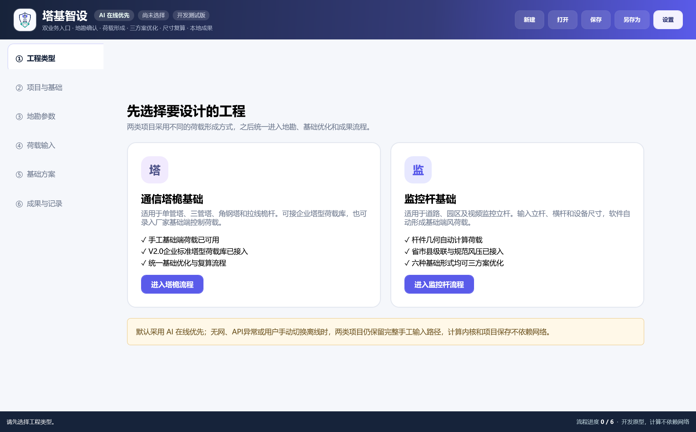
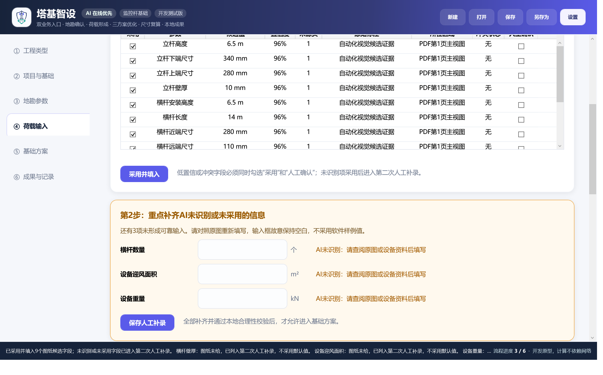
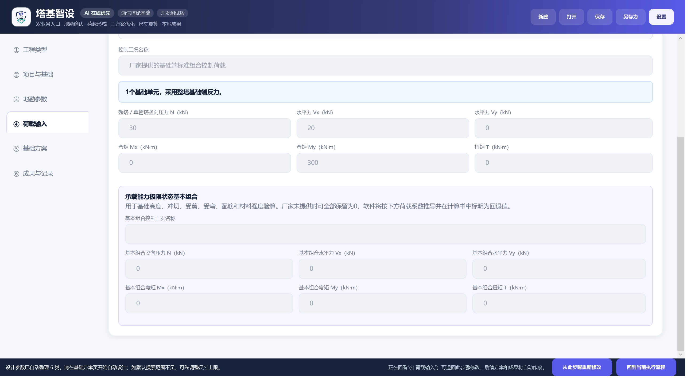
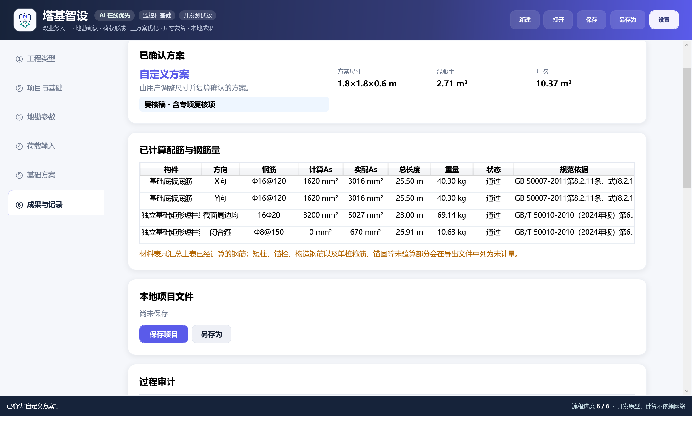

<div align="center">

# 塔基智设 TowerFoundation

**铁塔、塔桅与监控杆基础设计的 Windows 单机辅助软件**

AI 负责提取候选，本地内核负责确定性计算；联网优先、离线可用、过程留痕。

`Windows` · `.NET 10 / WPF` · `v0.9.21` · `78/78 完整环境回归`

[功能页面](https://yt365517671-glitch.github.io/TowerFoundation/) · [架构说明](docs/architecture.md) · [公式边界](docs/formula-audit.md) · [未公开资料](THIRD_PARTY_ASSETS.md)

</div>



## 软件解决什么问题

塔基智设面向通信铁塔、塔桅和道路监控杆基础设计场景，将地勘资料、厂家荷载、
基础方案、结构验算、配筋、CAD 和工程量串成六步流程。普通用户按“下一步”推进，
专业人员仍可退回历史步骤修改并重新计算。

它坚持三个边界：

1. **AI 只生成候选。** OCR、文字模型和视觉模型不得直接替代结构计算；每个候选保留来源页、原始证据、置信度和冲突信息。
2. **计算始终在本机。** 荷载组合、承载力、稳定、冲切、受剪、弯矩、配筋和工程量由 C# 确定性内核完成，无网也能手工输入并计算。
3. **缺少依据就留空。** 图纸没有的设备重量、迎风面积或关键地勘参数不会被 AI 编造；用户必须二次补录或转专业复核。

## 核心功能

### 双业务入口

- **通信塔桅基础：** 单管塔、三管塔、角钢塔、拉线桅杆和增高架；支持整塔反力、单塔脚反力和手工荷载。
- **监控杆基础：** 本地计算圆形管或正八边形对角尺寸杆件；分段横杆逐段累计风荷载、自重、弯矩、扭矩和钢材量。

### 六类基础与多塔脚拓扑

- 独立基础－矩形柱；
- 独立基础－圆形柱；
- 中央塔柱筏板基础；
- 刚性短柱桩基础－圆形；
- 刚性短柱桩基础－矩形；
- 独立灌注桩基础（无承台）。

三塔脚和四塔脚分离基础按实际拓扑生成闭合周边连系梁；整体筏板已经形成整体连接，
不会重复虚构连系梁。连系梁内力只有在整体分析结果经确认后才进入配筋计算。

### 图纸与地勘 AI 候选

- 扫描 PDF 分页渲染和局部高清裁切；
- 完整页、主视图、标题栏、规格区和分段壁厚区分开识别；
- 多型号候选列表、字段级证据、置信度、冲突和人工确认；
- 监控杆未识别字段集中进入第二次补录，不使用软件样例值；
- 识别记录按文件 SHA256 本地复用，避免重复调用模型；
- DeepSeek 与阿里云百炼 API Key 仅使用 Windows DPAPI 加密保存。



### 本地结构计算与成果

- 基底接触、承载力、抗滑、抗倾覆和抗浮；
- 冲切、受剪、底板受弯、短柱和桩身结构验算；
- 标准、基本、准永久、地震和偶然组合及采用轨迹；
- 经济、施工、稳健三种尺寸方案与自定义复算；
- Word/PDF 计算书、DXF 配筋图、材料表、钢筋下料表和工程量；
- 不依赖本机 AutoCAD、中望 CAD 或理正工具箱生成 DXF。

<table>
  <tr>
    <td></td>
    <td></td>
  </tr>
</table>

## 操作流程

```text
工程类型 → 项目与基础 → 地勘参数 → 荷载输入 → 基础方案 → 成果与记录
```

- 可以从后向前回看并选择“从此步骤重新修改”；
- 退回后保留原始输入，同时作废后续方案和成果，防止旧结果误用；
- 未来步骤只能预览，不能越级填写；
- 跨流程查看时可一键“回到当前执行流程”。

## 技术架构

```text
TowerFoundation.Desktop (WPF)
├── TowerFoundation.Licensing
└── TowerFoundation.Infrastructure
    └── TowerFoundation.Application
        └── TowerFoundation.Optimization
            └── TowerFoundation.Calculation
                └── TowerFoundation.Domain
```

- `Domain`：工程、地勘、荷载、几何、组合、验算和审计模型；
- `Calculation`：监控杆、浅基础、刚性短柱桩、独立灌注桩和连系梁确定性计算；
- `Optimization`：尺寸搜索、三策略评分和最近可行方案；
- `Application`：六步流程、校验、人工确认门禁和方案采用；
- `Infrastructure`：项目存储、PDF/Word/OCR/视觉适配、地区风压和成果导出；
- `Licensing`：离线机器码、两级 ECDSA P-256 签名、期限与日期回退校验；
- `Desktop`：品牌化 WPF 向导、证据复核和进度状态。

## 从源码构建

环境要求：Windows 10/11 x64、.NET 10 SDK。

```powershell
dotnet restore TowerFoundation.slnx
dotnet build TowerFoundation.slnx --configuration Release --maxcpucount:1
```

公开仓库没有附带企业标准塔型荷载数据、OCR 语言包和 CAD SHX 字体。源码会使用空企业库占位，
并在 SHX 资源不存在时继续生成标准 DXF，由接收端 CAD 按本机字体配置替代显示；
因此可编译并进入手工荷载流程；依赖这些第三方资料的数据实测需要维护者在合法授权范围内补充。
详见 [THIRD_PARTY_ASSETS.md](THIRD_PARTY_ASSETS.md)。

## 测试与发布证据

完整维护环境的 `v0.9.21` 发布记录：

- 核心回归：`78/78`；
- Release 构建：`0 warnings / 0 errors`；
- WPF 六步流程、未授权/已授权门禁、OCR 和四个 EXE 启动冒烟通过；
- 客户包敏感文件审计为 `0`；
- 开发设置构建前后 SHA256 一致。

公开源码副本也已独立验证：

- 编译：`0 warnings / 0 errors`；
- 核心回归：`78/78`；
- WPF 离线六步流程与未授权预览门禁冒烟通过；
- 公开文件审计：所有候选文件均未发现禁止项或已知密钥模式。

其中两项企业荷载库测试在公开占位模式下验证“空结果、不允许采用、明确提示手工录入”，
不代表对未公开的 446 条现行记录和 353 条历史记录进行了数据准确性复测。

## 授权与工程责任

仓库为 **source-available（源码可查看）**，并非 MIT/GPL 等 OSI 开源许可。
正式功能使用客户机器绑定授权；公开源代码不授予绕过授权、商业再发布或正式工程使用权。
详见 [LICENSE](LICENSE)。

软件输出属于辅助计算和复核材料，不能替代注册结构工程师审查、施工图审查、专项设计、
现场勘察或法定审批。缺少关键参数时，成果必须保持“复核稿/专业核对”状态。

## 安全与隐私

- 仓库不包含 API Key、客户授权、根私钥、机器状态、施工图、地勘报告和用户项目；
- 不要在 Issue 或 PR 中提交真实项目资料、机器码或任何密钥；
- 安全问题请参阅 [SECURITY.md](SECURITY.md)。

---

如果你正在评估代码，请优先阅读 [架构说明](docs/architecture.md) 和
[公式与规范核对记录](docs/formula-audit.md)。
