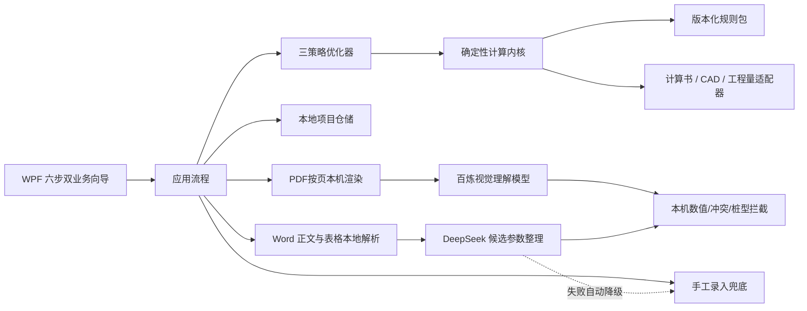

# 技术架构基线

## 1. 设计原则

- AI 在线优先：联网且密钥有效时，地勘PDF默认可由视觉理解模型直接读取，Word/OCR文字由DeepSeek整理；网络或 API 不可用时业务流程不能中断；
- 离线确定性：工程计算、方案优化、项目保存和成果输出始终在本机完成；
- 确定性计算：AI 只可提取和整理输入，不直接给出工程计算结论；
- 人工确认：地勘、塔型荷载、控制方案和正式成果均保留确认节点；
- 可追溯：项目保存输入来源、规则包版本、方案和操作审计；
- 分阶段解锁：未经过规范映射和基准算例验收的校核项不得显示为“通过”；
- 模块化单体：首版控制部署复杂度，同时保持计算、优化、基础设施和界面边界。

## 2. 运行架构

当前已实现双业务 UI、首页左塔桅/右监控杆入口、基础形式前置选择、按基础形式切换的地勘模板和六类基础：三类浅基础（独立基础－矩形柱、独立基础－圆形柱、中央塔柱筏板）、刚性短柱桩－圆形、刚性短柱桩－矩形、独立灌注桩+连梁。流程允许向前只读预览，历史步骤可明确退回修改；退回后保留原始输入并自动作废后续荷载、方案和成果。矩形刚性短柱桩具有独立长/宽/埋深搜索，X、Y向分别计算土抗力、刚度、刚性判别和内力，并形成矩形双向偏压配筋、闭合箍、材料工程量及DXF。其余已实现能力包括 JSON 项目仓储、默认项目目录/双击打开索引、PDF视觉直读、PDF原生文字层/本地 OCR、Word 本地解析、AI证据复核→本机确定性拦截→候选参数回填服务、AI 任务进度条、两类密钥独立DPAPI存储、结构化配筋结果、Word 计算书、材料/工程量 CSV 和配筋 DXF 输出。通信塔桅不要求选址；监控杆按地址取风压并执行0.35 kPa下限。单管塔或共同筏板采用整塔基础端反力；三管塔默认3个、角钢塔默认4个独立基础单元，增高架允许按实际3/4塔柱核对，均采用图集一个塔脚的承压、上拔和水平力包络，严禁把整塔反力平均分配。多塔柱采用任一相互独立的基础型式时，均按塔柱拓扑形成3根三角形闭合或4根四角周边连系梁；共同筏板本身整体连接，不重复生成独立连系梁。AI候选仍按成桩方法保存qsik、qpk、抗拔系数和水平承载力。沉降、裂缝、锚栓、特殊地基，以及桩身弯曲、变形、受剪、箍筋、连系梁配筋和连接构造仍由计算门禁显示为警告，正式施工图尚未开放。

## 3. 关键边界

### 3.1 Domain

只表达工程语义，不依赖 WPF、文件格式或网络。主要聚合为 `ProjectModel`，包含工程类型、地勘、监控杆、通信塔桅、基础设置、荷载、候选方案、已选方案和审计记录。

### 3.2 Calculation

输入是已确认的强类型参数，输出包含数值、状态、解释、控制工况和规则引用。计算模块不得读取 UI 控件、Word、PDF 或 DeepSeek 原始响应。

### 3.3 Optimization

只在计算内核判定可行的候选中选择。三种推荐不使用 AI：

- 经济优先：控制混凝土、土方和材料估算量；
- 施工优先：控制埋深、长宽差和施工复杂度；
- 稳健优先：控制最大利用率并保留余量。

### 3.4 Application

负责阶段门、校验、审计和用例编排。无论输入来自 OCR、Word、企业荷载库还是手工录入，最终都必须转换成相同的 Domain 模型。

尺寸调整建议也在应用层编排：计算层先返回明确的不满足项，建议器再进行针对性解释和附近尺寸搜索，不允许 AI 猜测应修改的尺寸。

### 3.5 Infrastructure

`IProjectRepository` 隔离持久化实现。原型使用 JSON 便于审阅和迁移；后续切换 SQLite 时不修改计算内核和界面流程。

`IProjectOutputService` 隔离成果输出。当前实现生成带校核过程和范围声明的 Word 计算书、按结构化配筋绘制的 DXF、材料 CSV、工程量 CSV 和 manifest。输出器只呈现确定性内核已经计算的钢筋，不用经验含钢量补齐；短柱、锚栓、灌注桩箍筋、连系梁配筋、锚固和连接等未完成内容在文件中明确列为未计量或需专项复核。所有独立基础型式的 DXF 与工程量均按塔柱数表达1/3/4个基础节点和闭合连系梁；灌注桩分支不生成承台图元。

## 4. 智能能力接入约束

地勘识别采用“视觉直读优先、文字/OCR备用、手工兜底”的闭环：

1. PDF 在本机按页渲染为90%质量JPEG，默认每批2页并使用150秒视觉专用超时；设置只列出经能力核验的Qwen视觉理解模型，不保留图片/视频生成模型；
2. PDF 也可优先在本机读取原生文字层，扫描件逐页 OCR；`.docx` 在本机读取正文和表格，再由DeepSeek建立事实证据清单；
3. 视觉请求遇到超时、限流、5xx或不完整JSON时自动重试；批次失败自动二分到单页，单页主模型仍失败时仅对该页启用快速视觉模型，随后再跨页回查表头、单位、冲突和适用桩型；
4. 本机规则再次验证每个数值确实出现于逐页证据，冲突值和不安全桩参数保持为空并要求人工确认；
5. 应用服务把安全识别到的项目名称、场址和数值直接填入对应表单，并保持“未确认”状态；冲突或缺失字段不自动猜测，连接失败、无密钥或纯离线模式自动回到OCR或手工录入。

所有候选字段保留来源文件、AI 证据说明、固定PDF页码、置信度和人工确认状态。视觉模型和DeepSeek均不可修改规则包，不可直接把自然语言答案作为计算结果。设置默认 `AI 在线优先`、文字模型`deepseek-v4-pro`和视觉模型`qwen3.7-plus`，也可手动切换 `纯离线模式`；两类API密钥独立以 Windows DPAPI 密文保存，不进入项目文件、日志、源码或 EXE。

## 5. 正式计算模块的准入条件

每个校核项至少需要：

- 规范名称、版本、条款和公式；
- 变量定义、单位和正负号约定；
- 适用基础类型和边界条件；
- 对应原计算书的基准算例；
- 手算或受信软件的独立对照结果；
- 正常值、边界值、失败值和单位错误测试；
- 计算书可追溯输出。

在上述条件完成前，界面只能显示“待完善”或“未校核”，不能显示为正式通过。
